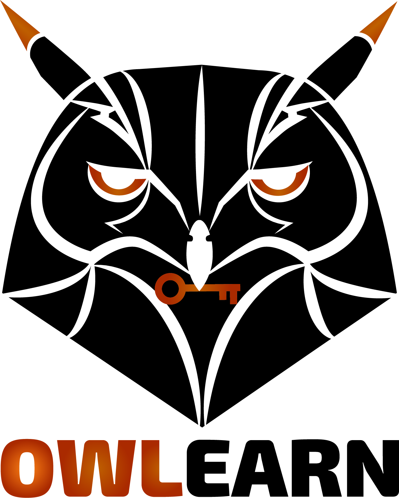

<center>
_“El diseño, propiedad y autoría de los parciales, simulacros, talleres y/o trabajos suministrados es propiedad de la Universidad Nacional de Colombia sede Medellín”_
</center>

<br>

Este sitio contiene información de algunos cursos de la universidad nacional sede Medellín, el material dado está sujeto a errores semánticos, procedimentales y a la interpretación del interesado.. 

```{r, echo=FALSE, out.width= "80", out.height="100",fig.align='center'}

```
  

</div>


<div align="right"> 
<br/>
<right> 
<!-- hitwebcounter Code START -->
<a href="http://www.hitwebcounter.com" target="_blank">

</a>                                        <br/>
                                                                                <br/>
                                        </div> 


                            